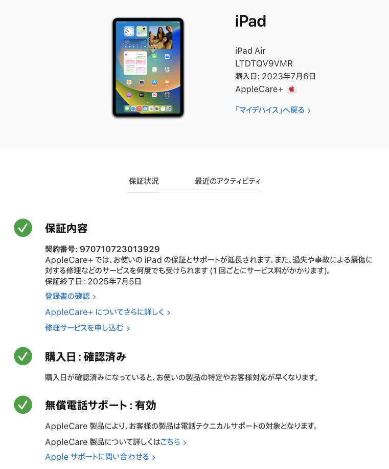

# メモ

## Apple Careについて

### 登録済みのCare
MacBook Air M1 2020  FVFGP1A1Q6LW

保証終了日：2024年11月25日


iPhone15 Pro Max  DXHYDYYH7C

保証終了日：2025年11月13日


iPad Air  LTDTQV9VMR

保証終了日：2025年7月5日




### バッテリー🔋交換基準

```text
Mac ノートブックのバッテリーは有償で交換できます。通常使用によるバッテリーの劣化は Apple の製品保証の対象外です。
AppleCare+ にご加入で、お使いの製品のバッテリー蓄電容量が本来の 80% 未満に低下している場合は、無償でバッテリーを交換できます。
```
